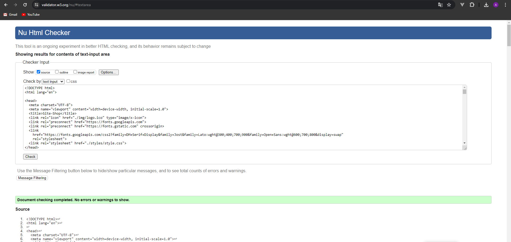

# [Главная страница интернет магазина](https://asalferova.github.io/Site-Shop/ "Ссылка на сайт")

## Описание проекта

Проект представляет собой главную страницу интернет-магазина, разработанную с использованием HTML и SCSS. 

##  Технологии  
   
   
   
   * Стили для страницы написаны с помощью SCSS, HTML написан по методологии **БЭМ**
   * Также на странице используется SVG спрайт для повторяющихся svg-иконок.
   * Страница адаптирована под все экраны.

Этот проект является демонстацией навыков вёрстки. Он был проверен с помощью инструментов аналитики и валидации.
В проекте не используется шаблонизация и он является статическим. 

## Скриншоты сайта

Здесь представлены три скриншота сайта:

1. Скриншот десктопной версии сайта
 

2. Скриншот планшетной версии сайта

3. Скриншот мобильной версии сайта

## Аналитика сайта

Сайт проанализирован встроенным инструментом chrome браузера Lighthouse

## Проверка HTML валидатором

Скриншот проверки HTML валидатором W3C:

